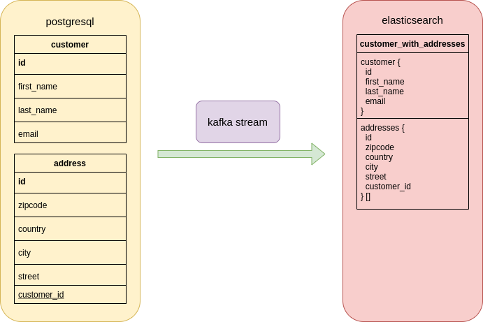
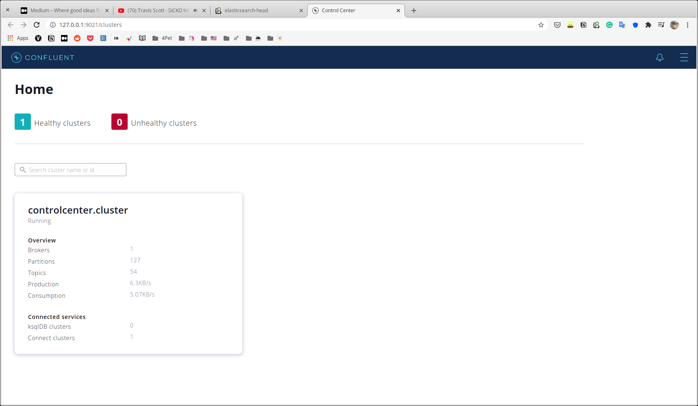

# debezium-example

Debezium Example | Postgres ➡️ Elasticsearch

### Schema

```
                   +-------------+
                   |             |
                   |  PostgreSQL |
                   |             |
                   +------+------+
                          |
                          |
                          |
          +---------------v------------------+
          |                                  |
          |           Kafka Connect          |
          |    (Debezium, ES connectors)     |
          |                                  |
          +---------------+------------------+
                          |
                          |
                          |
                          |
                  +-------v--------+
                  |                |
                  | Elasticsearch  |
                  |                |
                  +----------------+


```
We are using Docker Compose to deploy the following components:

* PostgreSQL
* Kafka
  * ZooKeeper
  * Kafka Broker
  * Kafka Connect with [Debezium](http://debezium.io/) and [Elasticsearch](https://github.com/confluentinc/kafka-connect-elasticsearch) Connectors
* Elasticsearch

## Install Java 11 & Maven

- https://jdk.java.net/
- https://maven.apache.org/

## Kafka Streams Foreign Key Joins

This example demonstrates how two Debezium change data topics can be joined via Kafka Streams,
using the new foreign key join feature in Apache Kafka 2.4 ([KIP-213](https://cwiki.apache.org/confluence/display/KAFKA/KIP-213+Support+non-key+joining+in+KTable)).

The source database contains two tables, `customers` and `addresses`, with a foreign key relationship from the latter to the former,
i.e. a customer can have multiple addresses.



```sh
cd aggregator-service
mvn clean package
```

## Run docker-compose.yml file

```sh
./scripts/start.sh
```

## Open http://127.0.0.1:9021/


 
## Deploy configs


## Install ElasticSearch Head & query data

https://chrome.google.com/webstore/detail/elasticsearch-head/ffmkiejjmecolpfloofpjologoblkegm


## Documents

- [Debezium Tutorial](https://debezium.io/documentation/reference/tutorial.html)
- [Confluent Hub](https://www.confluent.io/hub/)
- [KAFKA STREAMS](https://kafka.apache.org/documentation/streams/)

## License

https://github.com/4pet-social
